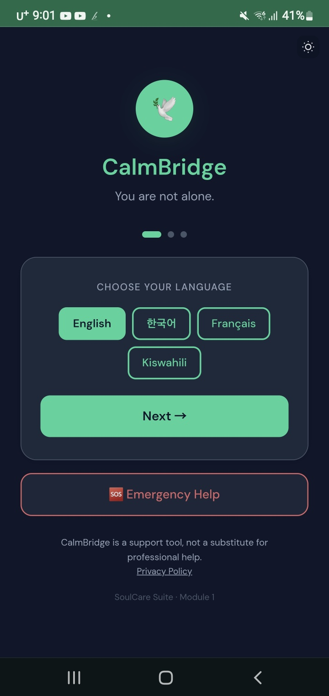
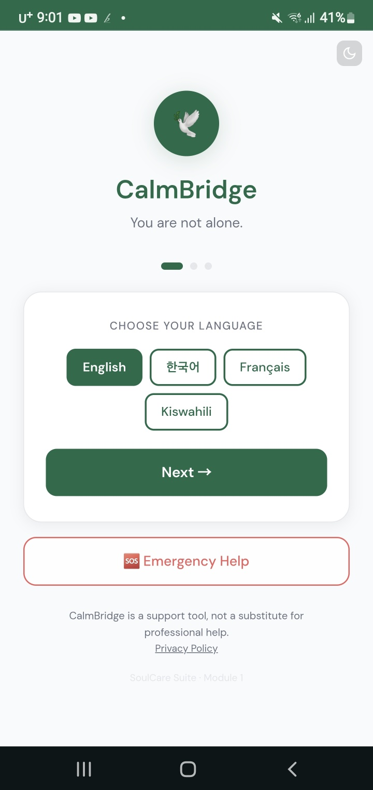
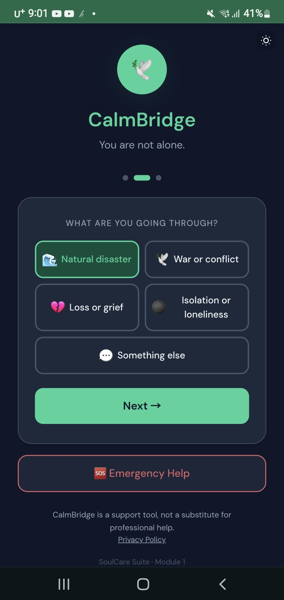
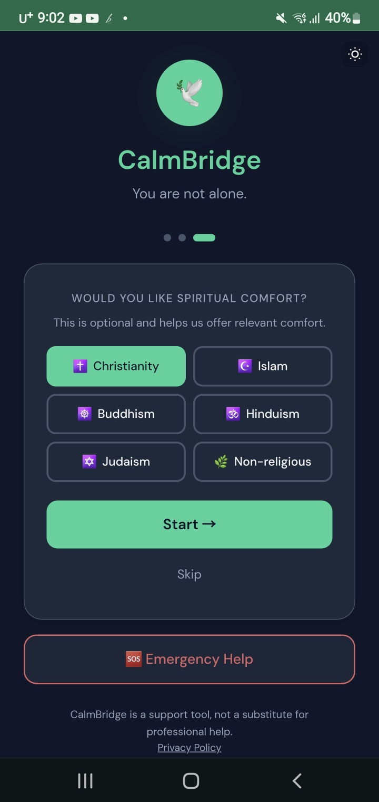
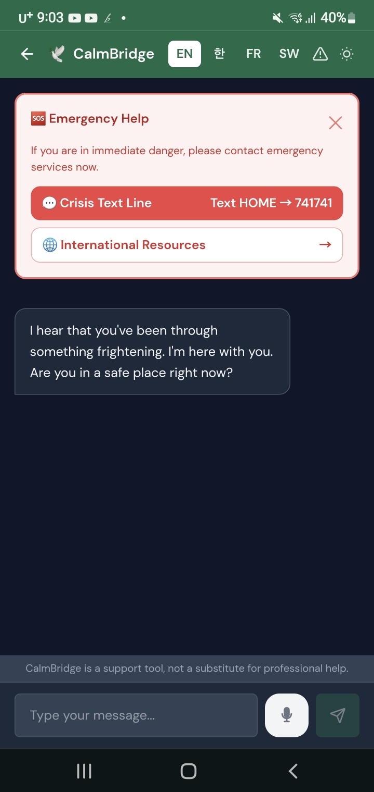
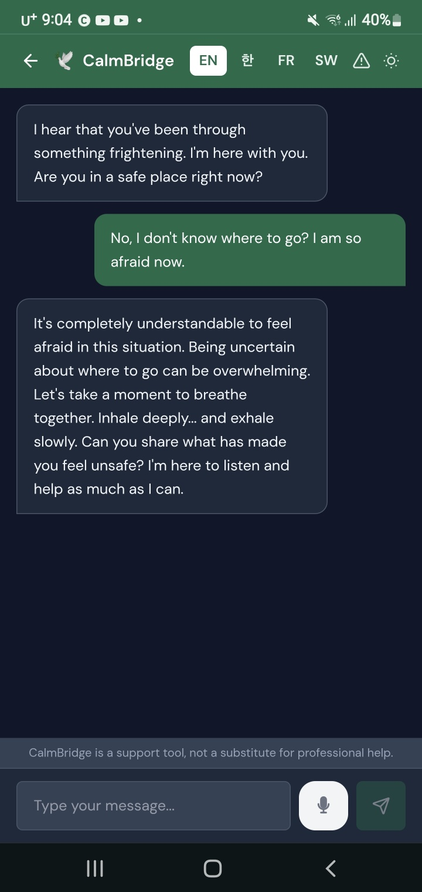
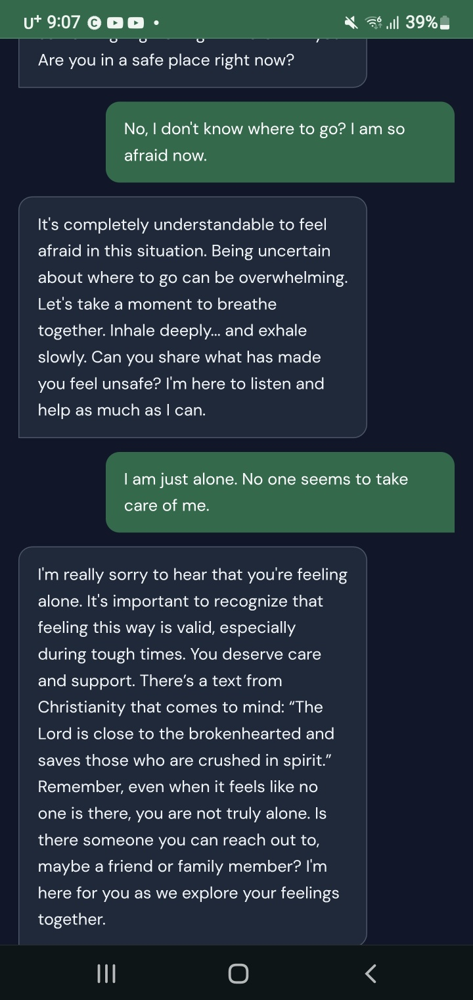
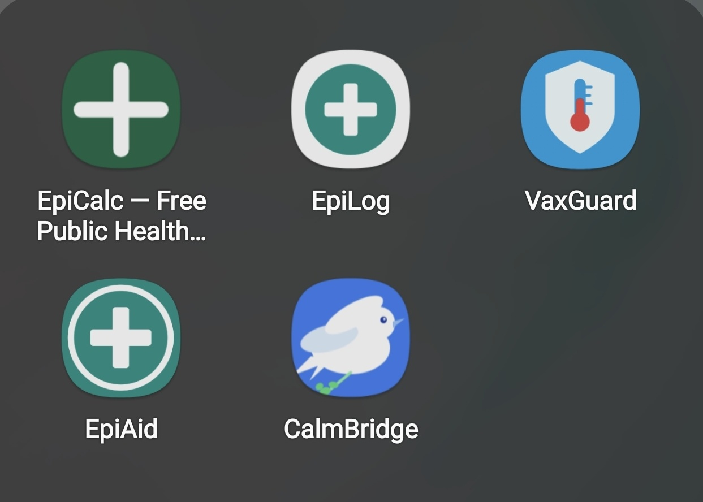

# CalmBridge 🕊️

> **Multilingual AI-powered Psychological First Aid (PFA) chatbot**
> *SoulCare Suite — Module 1*

[](LICENSE)
[](https://digitalpublicgoods.net)
[](https://www.who.int/publications/i/item/9789241548205)
[](src/i18n)
[](vite.config.ts)
[](https://calmbridge.pages.dev)
[](https://calmbridge.pages.dev)

**[Live App →](https://calmbridge.pages.dev)**

---

## ⚠️ Disclaimer

> **CalmBridge is a support tool — not a substitute for professional mental health care.**
>
> CalmBridge provides immediate emotional support following WHO Psychological First Aid principles. It does not diagnose, treat, or replace professional mental health services. In a life-threatening emergency, always contact local emergency services immediately.
>
> Crisis resources: Korea **1393** · France **3114** · Crisis Text Line (US/UK/IE/CA): Text HOME to **741741** · [International Resources](https://www.iasp.info/resources/Crisis_Centres/)

---

## Overview

CalmBridge provides immediate, compassionate emotional support to people in distress — survivors of disasters, individuals in mental health crises, and anyone who needs a calm, non-judgmental presence. It is built on the **WHO Psychological First Aid (PFA)** framework: **Look → Listen → Link**.

Designed for **low-resource, multilingual contexts**, CalmBridge works as a Progressive Web App (PWA) — installable on mobile devices with limited internet access.

---

## 🌍 Why CalmBridge?

According to the WHO, **1 in 4 people** will experience a mental health condition at some point in their lives. In disaster-affected regions and low-income countries, access to professional mental health care is severely limited. CalmBridge bridges this gap by:

- Providing **immediate, accessible** first-line emotional support
- Operating in **English, Korean, French, and Swahili** — covering over 700 million speakers
- Functioning as a **PWA** on any device, including low-end smartphones
- Following evidence-based **WHO PFA principles** — not replacing professionals, but holding space until they are available

---

## ✨ Features

| Feature | Description |
|---|---|
| 🧠 **WHO PFA Chatbot** | AI responses structured around Look-Listen-Link framework |
| 🔒 **Safety Filter** | Separates mental health crisis vs. disaster keywords; triggers appropriate protocols |
| 🌐 **4 Languages** | English, Korean, French, Swahili |
| 🕊️ **Spiritual Comfort** | Optional module with tradition-specific comforting texts (6 traditions) |
| 🎤 **Voice Input** | Web Speech API for hands-free input |
| 📴 **Offline Queue** | Messages saved to IndexedDB and auto-sent on reconnect |
| 📱 **PWA / Offline** | Installable, works with limited connectivity |
| ♿ **Accessible** | ARIA labels, keyboard navigation, screen reader support |

---

## 🏗️ Tech Stack
Frontend      React 19 + Vite + TypeScript + Tailwind CSS v4
Backend       Cloudflare Pages Functions (Edge, serverless)
AI            OpenAI GPT-4o-mini (WHO PFA system prompt)
i18n          i18next (EN / KO / FR / SW)
PWA           vite-plugin-pwa + Workbox (offline-first)
Offline       IndexedDB Background Sync (message queue)

---

## 📁 Project Structure
CalmBridge/
├── functions/api/chat.ts          # Cloudflare Pages Function
├── src/
│   ├── components/
│   │   ├── ChatPage.tsx           # Main chat interface
│   │   ├── SpiritualComfort.tsx   # Spiritual comfort module
│   │   └── VoiceInput.tsx         # Voice input
│   ├── lib/
│   │   └── offlineQueue.ts        # IndexedDB queue
│   ├── i18n/
│   │   ├── en.json / ko.json / fr.json / sw.json
│   └── main.tsx
└── vite.config.ts

---

## 🚀 Getting Started

```bash
git clone https://github.com/whlee5503-dot/CalmBridge.git
cd CalmBridge
npm install
cp .env.example .env.local
# Add: OPENAI_API_KEY=sk-...
npm run dev
```

### Deploy to Cloudflare Pages

```bash
npm run build
# Build command: npm run build
# Output dir:    dist
# Secret:        OPENAI_API_KEY
```

---

## 🧠 WHO PFA Framework Implementation

CalmBridge implements the [WHO PFA Field Guide (2011)](https://www.who.int/publications/i/item/9789241548205):

### Look — Observe and Assess
Silently assesses emotional state, safety level, and coping strengths. Tone adapts dynamically.

### Listen — Active Compassionate Listening
- Acknowledges feelings before offering solutions
- Validates reactions as normal responses to abnormal situations
- Offers grounding techniques for acute overwhelm

### Link — Connect to Support
- Provides crisis resources naturally
- Encourages connection with trusted people
- Distinguishes mental health crisis from disaster response

---

## 🔒 Safety Design

Detects suicidal ideation, self-harm, and disaster keywords in all 4 languages.

**Crisis resources:**
- International: [IASP Crisis Centres](https://www.iasp.info/resources/Crisis_Centres/)
- Crisis Text Line (US/UK/IE/CA): Text HOME to 741741
- Korea: 자살예방상담전화 **1393**
- France: **3114**

---

## 🕊️ Spiritual Comfort Module

Opt-in tradition-specific comfort texts in all 4 languages:

| Tradition | Symbol |
|---|---|
| Christianity | ✝️ |
| Islam | ☪️ |
| Buddhism | ☸️ |
| Hinduism | 🕉️ |
| Judaism | ✡️ |
| Secular / Non-religious | 🌿 |

---

## ♿ Accessibility

- WCAG 2.1 AA target
- Full keyboard navigation
- ARIA live regions for dynamic content
- Screen reader compatible
- No auto-playing audio

---

## 🌐 Internationalization

| Language | Code | Coverage |
|---|---|---|
| English | en | Full |
| Korean | ko | Full |
| French | fr | Full |
| Swahili | sw | Full |

---

## 📊 Lighthouse Scores

| Page | Performance | Accessibility | Best Practices | SEO |
|---|---|---|---|---|
| Welcome (/) | 98 | 96 | 100 | 100 |
| Chat (/chat) | 97 | 95 | 100 | 100 |

---

## 🧪 Test Suite

Built-in automated test suite (src/lib/testRunner.ts) evaluates AI response quality against WHO PFA principles.

### Latest Results (2026-06-05)

| Metric | Result |
|---|---|
| Average Score | **86 / 100** |
| Passing (≥80) | **8 / 12 scenarios** |
| Languages tested | EN · KO · FR · SW |

### Spiritual Comfort Results

| Tradition | Status |
|---|---|
| Islam | ✅ Pass |
| Buddhism | ⚠️ Partial |
| Christianity | ✅ Pass (EN) · ⚠️ Improving (KO) |
| Secular | ⚠️ Partial |

```bash
npm run dev
# Navigate to http://localhost:5173/test
```

---

## 📜 Digital Public Goods Alignment

| Criterion | Status |
|---|---|
| Open License (MIT) | ✅ |
| Clear Ownership | ✅ |
| Platform Independence (Web/PWA) | ✅ |
| Documentation | ✅ |
| Mechanism for Reporting (GitHub Issues) | ✅ |
| Data Privacy (no PII stored) | ✅ |
| Adherence to Standards (WHO PFA, WCAG 2.1) | ✅ |
| No Harmful Tracking | ✅ |

---

## 🌐 SoulCare Suite

| Module | App | URL |
|---|---|---|
| Module 1 | **CalmBridge** — AI PFA chatbot *(this app)* | [calmbridge.pages.dev](https://calmbridge.pages.dev) |

**EpiCalc Suite** (physical health tools):

| Module | App | URL |
|---|---|---|
| Module 1 | EpiCalc | [epi.chem-health-calc.com](https://epi.chem-health-calc.com) |
| Module 2 | EpiLog | [epilog-d72.pages.dev](https://epilog-d72.pages.dev) |
| Module 3 | EpiAid | [epiaid.pages.dev](https://epiaid.pages.dev) |
| Module 4 | VaxGuard | [vaxguard.pages.dev](https://vaxguard.pages.dev) |

---

## 📸 Screenshots

| Dark mode — Welcome | Light mode — Welcome |
|---|---|
|  |  |

| Onboarding — Situation | Onboarding — Spiritual |
|---|---|
|  |  |

| Crisis banner | Chat — PFA response |
|---|---|
|  |  |

| Spiritual quote in chat | Home screen icon |
|---|---|
|  |  |

---

## 🤝 Contributing

Please read [CONTRIBUTING.md](CONTRIBUTING.md) and follow trauma-informed, culturally sensitive guidelines.

---

## 📚 References

1. WHO. *Psychological First Aid: Guide for Field Workers.* WHO/MSD/MER/11.1. 2011.
2. WHO. *Mental Health Atlas 2020.* 2021.
3. Sphere Association. *The Sphere Handbook.* 2018.
4. IFRC. *Psychological First Aid — 2nd Edition.* 2018.
5. IASP. *Crisis Centres Directory.* https://www.iasp.info/resources/Crisis_Centres/

---

## 👨‍💻 Developer

**Won Ho Lee, Ph.D., MPH, MDiv**
Public health researcher, field medicine educator, and pastoral care practitioner.

Built for those who are alone in the hardest moments.

---

## 📄 License

MIT License — see [LICENSE](LICENSE).

---

## 🙏 Acknowledgements

- [WHO — Psychological First Aid Field Guide](https://www.who.int/publications/i/item/9789241548205)
- [International Association for Suicide Prevention](https://www.iasp.info)
- All crisis counselors and mental health workers whose work inspired this project

---

*CalmBridge — a calm presence when it matters most.* 🕊️
